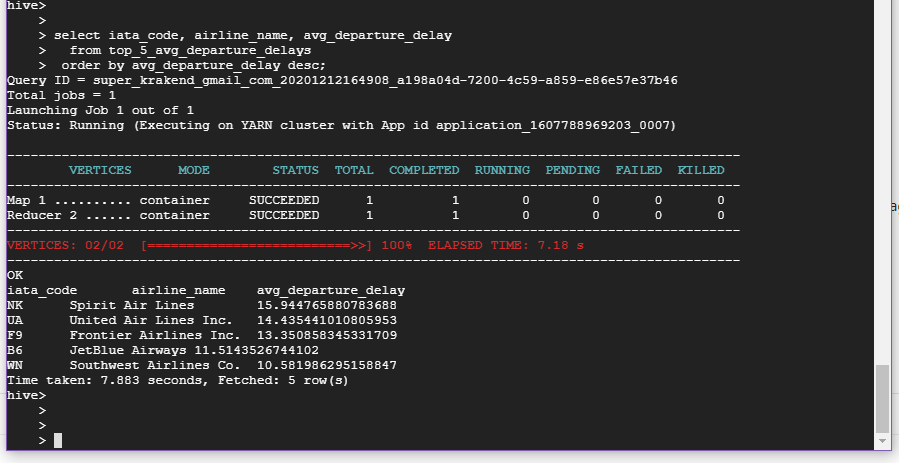

# Homework

# Solution

### Manually created bucked 
### drug & drop archive.zip using UI


### Transcript

```
# copy from backet to master node
gsutil cp gs://hive_laba-1/globallogic-procamp-bigdata-datasets/2015_Flight_Delays_and_Cancellations/archive.zip .

# unzip on master
unzip archive.zip -d ~/flight_delays
cd ~/flight_delays

# show file structure
head airlines.csv
head airports.csv
head flights.csv

# create HDFS directories for files
hdfs dfs -mkdir -p /data/flight_delays/airlines
hdfs dfs -mkdir -p /data/flight_delays/airports
hdfs dfs -mkdir -p /data/flight_delays/flights

# copy from local to HDFS
hdfs dfs -copyFromLocal airlines.csv /data/flight_delays/airlines/airlines.csv
hdfs dfs -copyFromLocal airports.csv /data/flight_delays/airports/airports.csv
hdfs dfs -copyFromLocal flights.csv /data/flight_delays/flights/flights.csv

# verify data is in there
hdfs dfs -ls /data/flight_delays

# start hive console
hive

# create hive db
create database ktochylin_db;

# show databases
show databases;

use ktochylin_db;

# tune to see column names
set hive.cli.print.header=true;

# create Hive tables
CREATE EXTERNAL TABLE IF NOT EXISTS airlines
(iata_code string,
airline string)
ROW FORMAT DELIMITED
FIELDS TERMINATED BY ','
STORED AS TEXTFILE
LOCATION '/data/flight_delays/airlines/'
tblproperties ("skip.header.line.count"="1");

select * from airlines limit 5;

CREATE EXTERNAL TABLE IF NOT EXISTS flights
(year  int,
month  int,
day  int,
day_of_week  int,
airline  string,
flight_number  int,
tail_number  string,
origin_airport  string,
destination_airport  string,
scheduled_departure  int,
departure_time  int,
departure_delay  int,
taxi_out  int,
wheels_off  int,
scheduled_time  int,
elapsed_time  int,
air_time  int,
distance  int,
wheels_on  int,
taxi_in  int,
scheduled_arrival  int,
arrival_time  int,
arrival_delay  int,
diverted  int,
cancelled  int,
cancellation_reason  string,
air_system_delay  int,
security_delay  int,
airline_delay  int,
late_aircraft_delay  int,
weather_delay  int)
ROW FORMAT DELIMITED
FIELDS TERMINATED BY ','
STORED AS TEXTFILE -- try to remove this line
LOCATION '/data/flight_delays/flights/'
tblproperties ("skip.header.line.count"="1");

select * from flights limit 5;
  
CREATE TABLE top_5_avg_departure_delays
ROW FORMAT DELIMITED
FIELDS TERMINATED BY ','
STORED AS TEXTFILE
LOCATION '/data/flight_delays/top_n_reporting/'
AS
WITH top_avg_delays AS (
  SELECT airline, AVG(departure_delay) as avg_departure_delay
    FROM flights 
   GROUP BY airline 
  ORDER BY avg_departure_delay DESC
  LIMIT 5)
SELECT ar.iata_code,
       ar.airline as airline_name,
       tad.avg_departure_delay
  FROM top_avg_delays tad
  LEFT JOIN airlines ar on (ar.iata_code = tad.airline);

select iata_code, airline_name, avg_departure_delay
  from top_5_avg_departure_delays
 order by avg_departure_delay desc;
```

### Result

