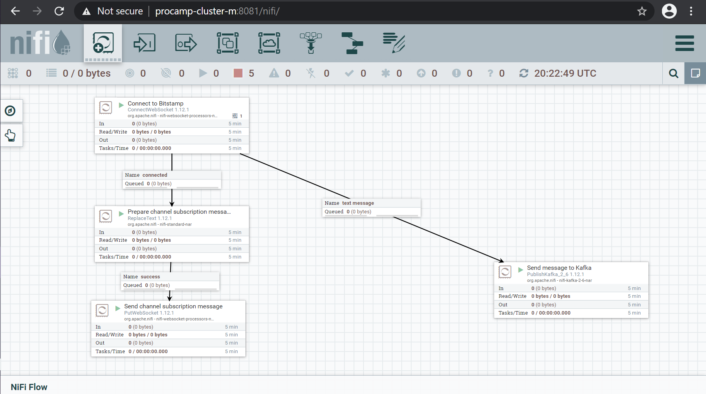
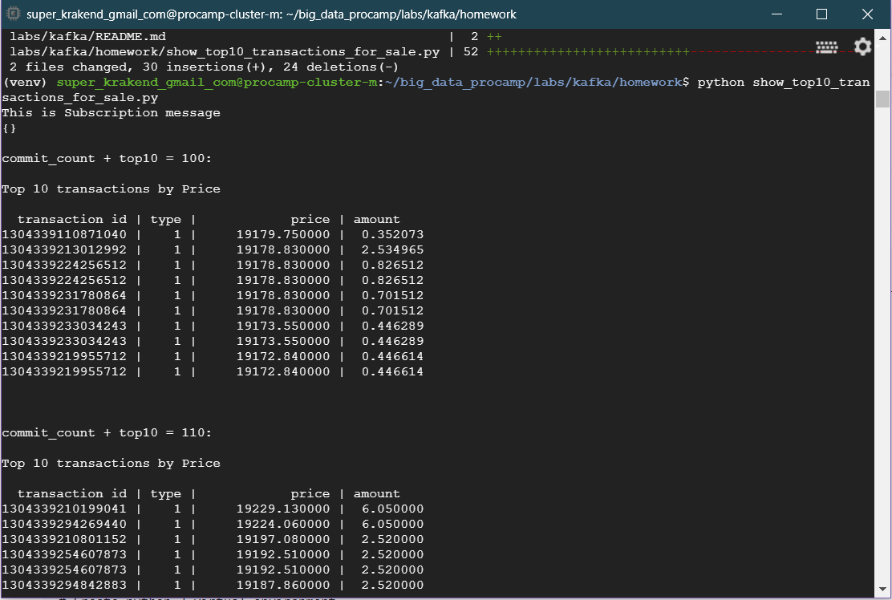

# Apache Kafka Lab 1

## My changes: it shows Top 10 out of 100 messages with Top 10 updated as in description

# Solution

## NiFi part


### Deploy NiFi ingestion process manually
### and start workflow before run Kafka application

\big_data_procamp\labs\kafka\homework\nifi\bitstamp_kafka_publisher.xml

### Do not forget these settings

Property            | Value
--------------------|-------------------------------
Truststore Filename | /opt/gl-bigdata-procamp/bitstamp.truststore
Truststore Password | truststore
Truststore Type     | JKS

Name         | Value
-------------|-------------------------------
CurrencyPair | btcusd

### After deployment run this process

### NiFi workflow


## Kafka part

### kafka application should be interrupt by Ctrl + C command
### below instructions I run on master node form logged in user folder

```
# Create Kafka Topic
/usr/lib/kafka/bin/kafka-topics.sh --create --zookeeper localhost:2181 --replication-factor 3 --partitions 1 --topic bitstamp.transaction.btcusd

# Verify Kafka Topic
/usr/lib/kafka/bin/kafka-topics.sh --list --zookeeper localhost:2181

# Clone GIT project with application
git clone https://github.com/ktochylin/big_data_procamp.git

# Go to GIT repository
cd ~/big_data_procamp

# Verify we are in a main branch
git branch

git pull

# Create python 3 virtual environment
mkdir venv

virtualenv --python=python3 venv

# Activate virtualenv
source venv/bin/activate

# Install proprietary Kafka library
pip install confluent-kafka

# Go to application folder
# cd ~/big_data_procamp/labs/kafka/homework/
cd labs/kafka/homework

# Run application
python show_top10_transactions_for_sale.py

```

### Kafka application output
