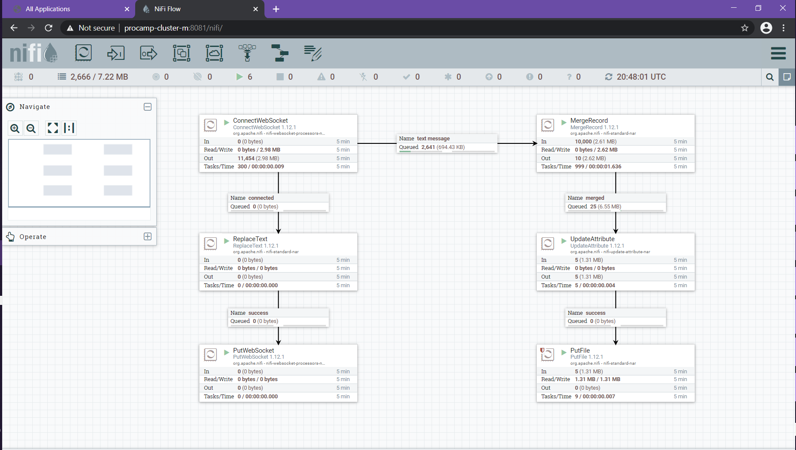
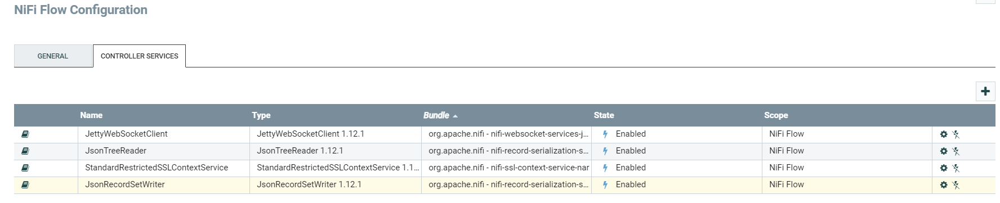
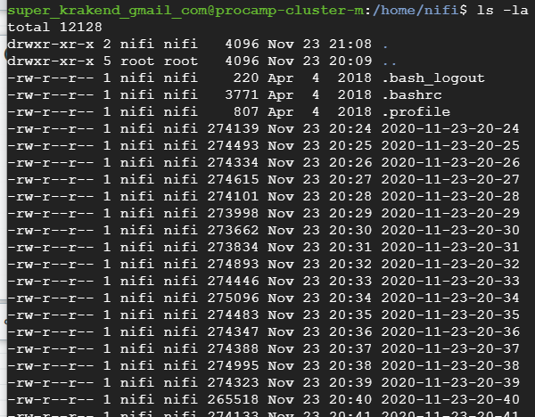
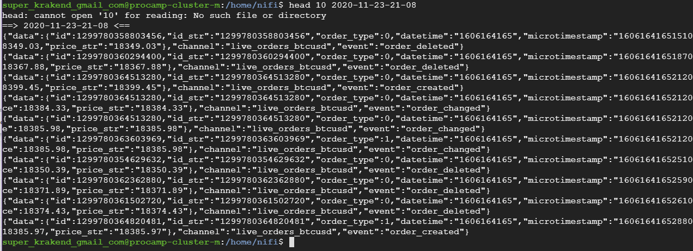
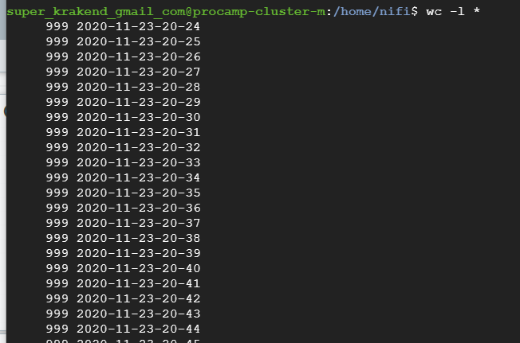

# Homework

Save bitstamp messages to the local file system on a master node every minute

Folder structure on local file system: /home/nifi/yyyy-MM-dd-HH-mm

!DON'T FORGET TO STOP YOUR PROCESSORS AFTER TESTING!

Please send a link to your github repo with results (xml template) to the kyiv-procamp@globallogic.com email address with the "HW1" text in the header

The deadline for this task by 23/11/2020

Good luck!

# Solution

## Do not forget these settings

Property            | Value
--------------------|-------------------------------
Truststore Filename | /opt/gl-bigdata-procamp/bitstamp.truststore
Truststore Password | truststore
Truststore Type     | JKS

Name         | Value
-------------|-------------------------------
CurrencyPair | btcusd

  I've changed homework definition to make task a bit more complex 
and to try different processors and controllers:
  
1. Added MrgeRecord processor to create output FlowFile with 1000 records each.
it will give same size files on disc which should cause smooth workload of a
process which will read the filea later.

for that I've created two controller services:
- JsonTreereader
- JsonRecordSetWriter - is configured to write OneLinePerObject

2. Added UpdateAttribute to set file name according to format yyyy-MM-dd-HH-mm
it schedule to work every minute = 60 seconds

## NiFi workflow

## Controller Services

## Master /home/nifi/yyyy-MM-dd-HH-mm

## File inside

## As wc -l counts only new lines, line count is 999

