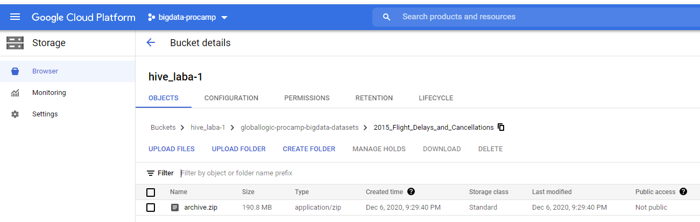
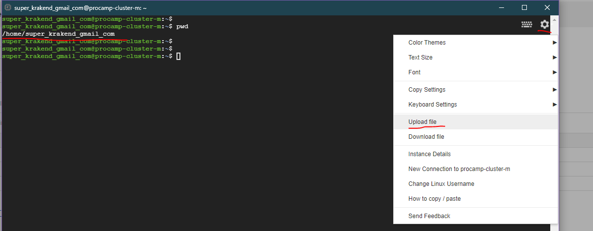
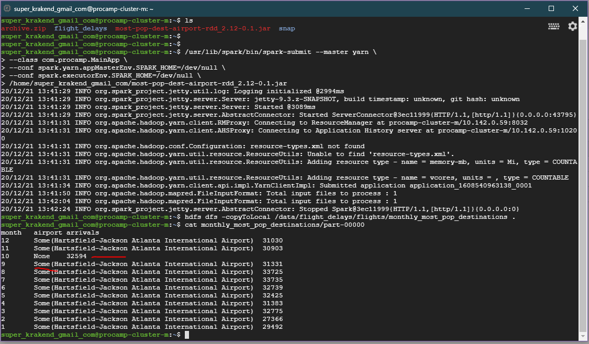

# Homework: Spark-submit RDD application

## Solution

### Result is aggregated to the single file

### Manually created bucked 
### drug & drop archive.zip using UI



### Upload JAR to master-node via SSH



### Transcript

```
# copy from backet to master node
gsutil cp gs://hive_laba-1/globallogic-procamp-bigdata-datasets/2015_Flight_Delays_and_Cancellations/archive.zip .

# unzip on master
unzip archive.zip -d ~/flight_delays
cd ~/flight_delays

# show file structure
head airports.csv
head flights.csv

# create HDFS directories for files
hdfs dfs -mkdir -p /data/flight_delays/airports
hdfs dfs -mkdir -p /data/flight_delays/flights

# copy from local to HDFS
hdfs dfs -copyFromLocal airports.csv /data/flight_delays/airports/airports.csv
hdfs dfs -copyFromLocal flights.csv /data/flight_delays/flights/flights.csv

# verify data is in there
hdfs dfs -ls /data/flight_delays

# Upload JAR to the master-node /home/user_name directory via SSH
# big_data_procamp\labs\spark\homework\lab1-1-rdd\most-pop-dest-airport-rdd_2.12-0.1.jar

# also you can biuld RAR on your own using project sources at
# big_data_procamp\labs\spark\homework\lab1-1-rdd

# run spark-submit application, expected time is 1-2 min
/usr/lib/spark/bin/spark-submit --master yarn \
--class com.procamp.MainApp \
--conf spark.yarn.appMasterEnv.SPARK_HOME=/dev/null \
--conf spark.executorEnv.SPARK_HOME=/dev/null \
/home/user_name/most-pop-dest-airport-rdd_2.12-0.1.jar

# copy result to local filesystem
hdfs dfs -copyToLocal /data/flight_delays/flights/monthly_most_pop_destinations .

# verify result
cat monthly_most_pop_destinations/part-00000
```

### Result interpretation

#### As I did join of airports as left join, I've got airport name with "Some" coverage
#### and did not remove it, sorry

#### also I've got airport codes as didgits instead of symbols as expected
#### did not investigate deeper, it could be kind of garbage


